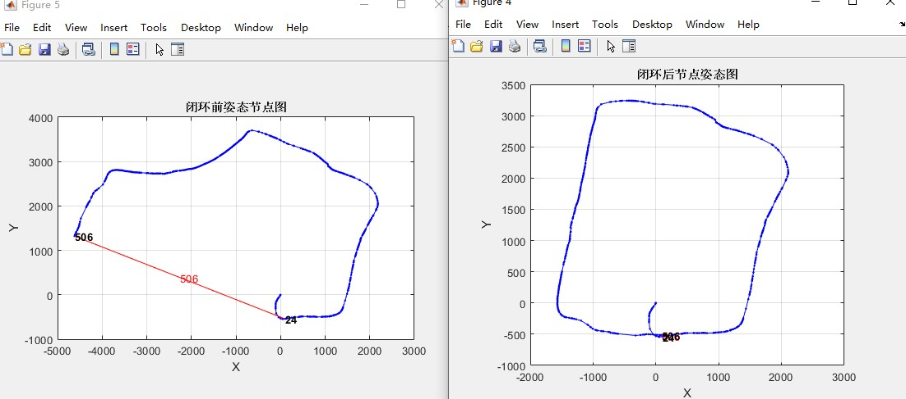
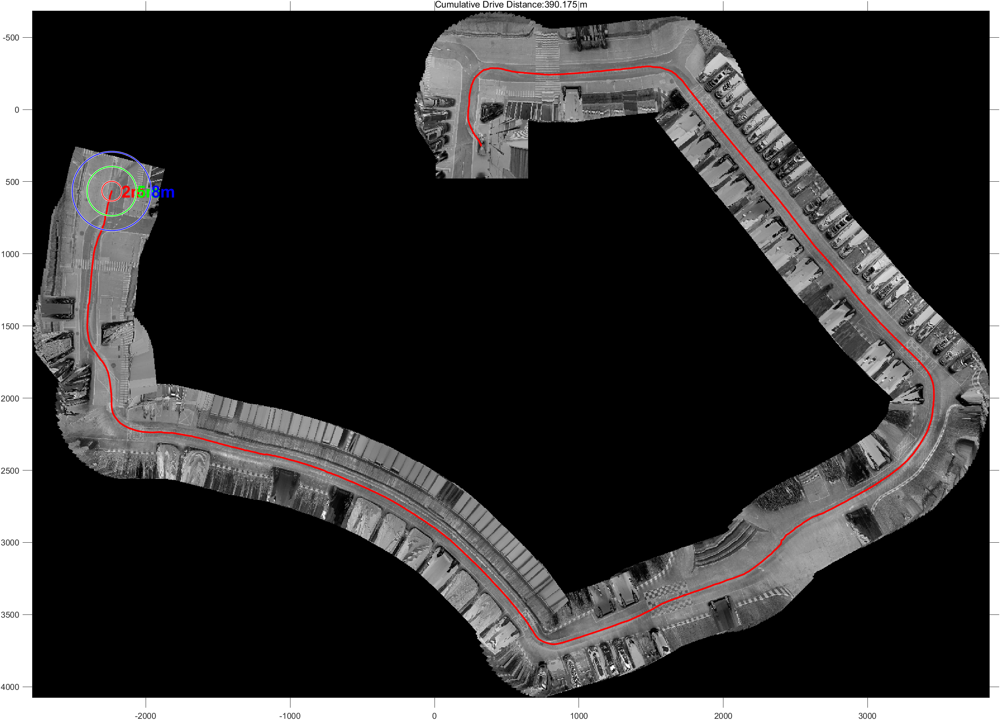
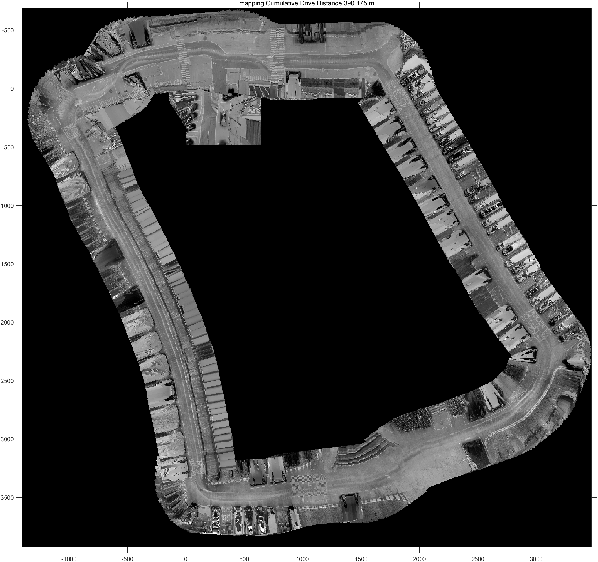
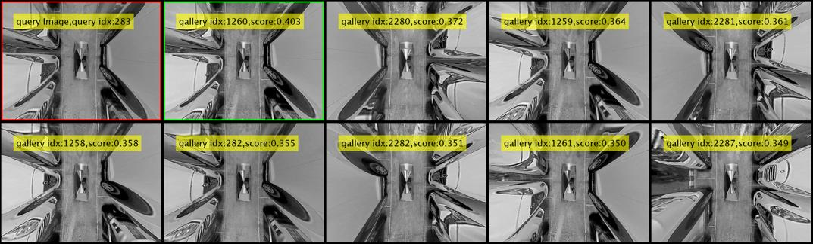
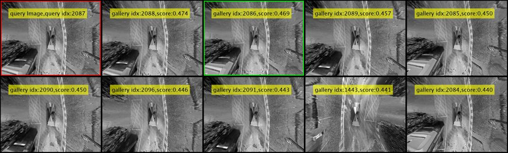
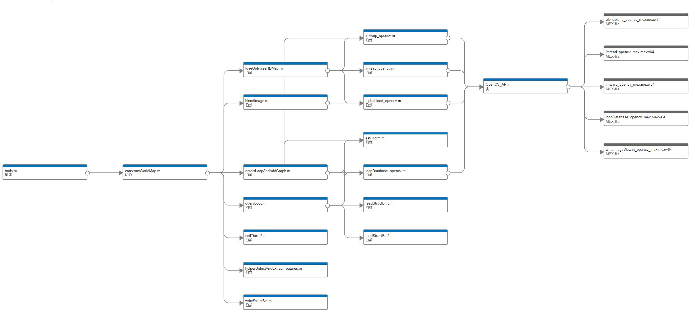
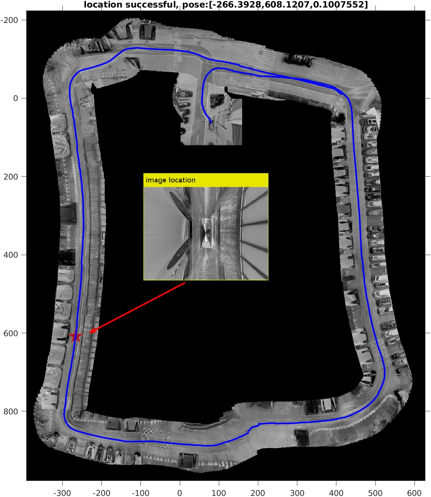

# Visual-Based Odometry Estimation2

This repo is an enhanced version of [Visual-Based Odometry Estimation](https://github.com/cuixing158/Visual-Based-Odometry-Estimation). In addition to supporting the existing features(following Features), it adds loop detection and graph optimization, supports efficient C/C++ code generation, allows for [deep customization with a C++ OpenCV MEX interface, and enables hybrid programming](./codegen_custom_cpp/README.md)!

## Features

- Real-time application construction without the need to predefine the map size
- Pixel maps correspond directly to physical maps, facilitating easy query and localization
- Based on pure image algorithm only (no IMU, GPS, WheelEncoder, etc. to assist).
- Supports embedded C/C++ code generation

## Requirements

MathWorks Products(<www.mathworks.com>)

- MATLAB® R2022b or later
- Computer Vision Toolbox™
- Image Processing Toolbox™
- Navigation Toolbox™

Open C++ Library:

- OpenCV 4.x（Open Source Computer Vision Library）

Complier

- C++ Compiler (e.g., GCC, Clang, or MSVC)

## Loop closure detection and optimization

姿态图节点图优化:<br>



全局像素图像优化前:<br>



全局像素图像优化后:<br>



集成的DBOW3使用MATLAB的ORB特征，检索效果略好于matlab build-in 的bof。为便于对比，算法设置同样的参数配置，top9 view,queryID分别选取283、300、2087与上述进行对比。

测试基准：使用MATLAB内建函数`detectORBFeatures`和`extractFeatures`默认设置的结果特征输入给原始DBOW3，每张图片提取的特征数定固定为为尽可能多(HXW，一般典型特征点数量5000左右)，无均匀处理。2687张480x640图片提取的词袋特征耗时17min左右！

queryID=283，DBOW3表现,同样，绿色框为re-ranking的最佳选择：


queryID=300，DBOW3表现,同样，绿色框为re-ranking的最佳选择：


queryID=2087，DBOW3表现,同样，绿色框为re-ranking的最佳选择：


*另外关于loopClosure运作机理详细情况请参阅[窥探loop closure姿态图优化的运作机理](./loopClosureAnalyze.md)*。

## Performance

硬件：4 cores,Intel(R) Xeon(R) Gold 6226 CPU @ 2.70GHz,754G RAM <br>
软件：Ubuntu20.04,MATLAB R2023a,OpenCV 4.6.0<br>

### 词袋生成性能

benchmark: 使用最初提供的的$480\times640$大小灰度图像,共2687张图像,典型每张图像最多能检测到4000~5000个orb特征点。

- OpenCV内建函数`detectAndCompute`的ORB特征检测器除了`numFeatures`参数其他均按照默认设置
- MATLAB内建函数`detectORBFeatures`和`extractFeatures`使用同OpenCV的默认设置

分别在[本2D SLAM主模块](./constructWorldMap.m)中将提取到的ORB特征输入给原始C++版本的DBOW3,测试生成词袋特征性能和最相似分数分布，见下表。

|                                                  | #Max features(numFeatures)   | Time consuming generation of database.yml.gz | Most similarity score distribution(mode) |
| :----------------------------------------------: | :-------------: | :-------------: | :-------------:  |
| DBOW3(opencv extract image features input)       | 2000            | >7.15min        | 0.2              |
| DBOW3(MATLAB extract image features input)       | 1000            | 3.3min          | 0.17             |
| DBOW3(MATLAB extract image features input)       | 2000            | 7.15min         | 0.2              |
| DBOW3(MATLAB extract image features input)       | all             | 17min           |0.4               |

从上表可知：生成词袋特征耗时主要受到`#Max features(numFeatures)`因素的影响，这主要是因为特征较多时候，创建视觉单词计算量较大，聚类，TF-IDF都会受到影响，相似性分数分布普遍较高，符合我们直观感受。可根据实际情况斟酌选用组合。

### 数据序列化/反序列化性能

对于MATLAB结构体数据序列化/反序列化，支持针对**任意通用**MATLAB结构体数据结构，不依赖具体的数据类型，并认真做了实践比较，参考见下表：

|  serializers                      | Size   | Load Avg Time(sec) | Save Avg Time(sec) |
| :--------------------: | :-------------: | :-------------: | :-------------:  |
| [opencv(yml.gz)](https://docs.opencv.org/4.6.0/dd/d74/tutorial_file_input_output_with_xml_yml.html)      | 145M           | 17.27          | 25.52              |
| [cereal(binary)](http://uscilab.github.io/cereal/index.html)      | 110M            | 0.49        | 0.51              |
| [boost](https://www.boost.org/doc/libs/1_72_0/libs/serialization/doc/tutorial.html)      | 待测            | 待测        | 待测              |
| [matlab内置(mat)](https://www.mathworks.com/help/matlab/import_export/mat-file-versions.html)       | 84M            | 0.76          | 5.06             |
| 自己方法实现的       | 110M            | 0.42         |  0.43              |

```C++
typedef struct imageViewSt {
    cv::Mat descriptors;
    std::vector<cv::Point2d> keyPoints;
} imageViewSt;
```

与之对应MATLAB数据结构体imageViewSt为

```text
struct array with fields:
    Features
    Points
```

存储数据设计为含有1198个结构体的数组，每个结构体有两个域段`Features`和`Points`，其`Features`为$2000\times32$大小的uint8数据，`Points`为$2000\times2$大小的double数据，在C++和MATLAB环境下数据类型和大小均保持一致！测试脚本见[unitTestSuitsAndBenchMark](./unitTestSuitsAndBenchMark.m)和[cereal_benchmark](https://github.com/cuixing158/DBOW3/utils/demo_cereal_bench.cpp)。关于boost未测，但可参考[此处](https://github.com/thekvs/cpp-serializers)间接比较。

## Function Dependency Graph



## Image Localization

利用已经建好的地图，加载视觉特征，然后随机给定一定位图片，定位效果图如下：

