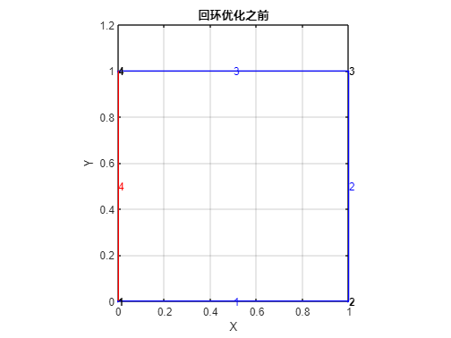

# 窥探loop closure姿态图优化的运作机理

 崔星星2022.12.7 首次记录

 2023.1.4 加入factorGraph对比

 2023.2.13 修改factorGraph正确使用方式

 ---

>姿态图优化一般用于SLAM检测到loop的后续步骤，目的在于寻找一条合理的路径使得累计观察到的位姿误差达到最小，算法一般采用Gauss-Newton、LevenBerg-Marquardt方法求解。

待优化的总目标函数为[1]：

<center></center>

在实际通用工程中直接调用第三方优化库ceres或者g2o求解可得，但为了更好更方便的理解其运作机理，幸运的是近年来TMW持续在SLAM姿态图优化方面不断引入新features，包括但不限于vSLAM,lidar SLAM等[3]的各个方面姿态图，比如vSLAM中的imageViewSet类对象函数createPoseGraph,lidar SLAM中的poseGraph/ poseGraph3D,factorGraph,它们对应的优化函数optimizePoses,optimizePoseGraph,optimize本质上是一致的，目的都是求解上面优化问题，只是适用场合不一样。下面以2D SLAM（限定于平面内点集）中姿态图优化问题设计实验并可视化，达到即想即所用的目的，加深其运作机理的理解。

---
2023年1月已解决factorGraph的角度问题，推荐使用factorGraph,理由推荐下面[Reference](#references) Q&A.
**结论：无论是poseGraph还是factorGraph，添加相对姿态时，都是以自身坐标系的相对值，[Example2](#example2)表面上是以全局"相对坐标系"进行的，但实质上仍然是相对自身坐标系而言的！**

测试脚本见[test_optimizeGraph.m](../test/test_optimizeGraph.m)

## Example1

设计在一条直线上观测到的4个绝对坐标点(0,0),(1,0),(2,0),(3,0),节点(node)序号分别为1,2,3,4，在最后一个节点4观测到节点1的相对坐标为(-2.8,0)，即闭环loop，可以看出最后一个节点误差是0.2。即这个姿态图包含4个边,其中前3条是里程计，最后一条是闭环边。

```matlab
absNodes = [0,0; % node1
    1,0;% node2
    2,0;% node3
    3,0];% node4

relPose = [1,0,0; % [x,y,theta]
    1,0,0;
    1,0,0;
    -2.8,0,0];

pg = poseGraph();

addRelativePose(pg,relPose(1,:),[],1,2);% odometry
addRelativePose(pg,relPose(2,:),[],2,3);% odometry
addRelativePose(pg,relPose(3,:),[],3,4);% odometry
addRelativePose(pg,relPose(end,:),[],4,1);% loop closure
figure;show(pg,"IDs","all"); title('回环优化之前')
```


```matlab
oldNodes = nodeEstimates(pg)
```

```text:Output
oldNodes = 4x3    
     0     0     0
     1     0     0
     2     0     0
     3     0     0

```

```matlab
updatedGp = optimizePoseGraph(pg);
figure;show(updatedGp,"IDs","all"); title('回环优化之后')
```


```matlab
newNodes = nodeEstimates(updatedGp)
```

```text:Output
newNodes = 4x3    
         0         0         0
    0.9500         0         0
    1.9000         0         0
    2.8500         0         0

```

可以看出姿态图优化后，节点坐标有稍微调整。

## Example2

设计一平面矩形，其观测到的4个绝对坐标点(0,0),(1,0),(1,1),(0,1),节点(node)序号分别为1,2,3,4，在最后一个节点4观测到节点1的相对坐标为(0,-0.2)，即闭环loop，可以看出最后一个节点误差是0.2。即这个姿态图包含4个边,其中前3条是里程计，最后一条是闭环边。

```matlab
abspos = [0,0,0;
    1,0,0;
    1,1,0;
    0,1,0;
    0,0.2,0];

relPose = diff(abspos);
pg = poseGraph();

addRelativePose(pg,relPose(1,:),[],1,2);% odometry
addRelativePose(pg,relPose(2,:),[],2,3);% odometry
addRelativePose(pg,relPose(3,:),[],3,4);% odometry
[nodePair,edgeID] = addRelativePose(pg,relPose(end,:),[],4,1);% loop closure

oldNodes = nodeEstimates(pg)
```

```text:Output
oldNodes = 4x3    
     0     0     0
     1     0     0
     1     1     0
     0     1     0

```

```matlab
figure;show(pg,'IDs','all'); title('回环优化之前')
```


```matlab
updatedGp = optimizePoseGraph(pg);
newNodes = nodeEstimates(updatedGp)
```

```text:Output
newNodes = 4x3    
         0         0         0
    1.0008   -0.0400    0.0200
    0.9816    0.9198    0.0400
   -0.0168    0.8398    0.0199

```

```matlab
figure;show(updatedGp,"IDs","all"); title('回环优化之后')
```


同样可以看出姿态图优化后，节点坐标有稍微调整。

## Example3

设计一平面矩形，其观测到的4个绝对坐标点(0,0),(1,0),(1,1),(0,1),节点(node)序号分别为1,2,3,4，在最后一个节点4观测到节点1的相对坐标为(0,-0.2)，即闭环loop，可以看出最后一个节点误差是0.2。即这个姿态图包含4个边,其中前3条是里程计，最后一条是闭环边。但要考虑相对姿态角度(弧度)，每次测量值是相对当前姿态而言。下图示意图五角星是观测到的目标，在当前姿态坐标系Ov下的相对坐标是[x,y,θ].


```matlab
% abspos = [0,0,0;
%     1,0,90*pi/180;
%     1,1,180*pi/180;
%     0,1,270*pi/180];

% relPose = diff(abspos);% 注意这个相对值是针对全局世界坐标系，不是局部坐标系,故不能添加到addRelativePose函数的measurement中去
% relPose = [relPose;0,0.2,90*pi/180];
relPose = [1,0,pi/2;
    1,0,pi/2;
    1,0,pi/2;
    0.8,0,pi/2];
pg = poseGraph();

addRelativePose(pg,relPose(1,:),[],1,2);% odometry
addRelativePose(pg,relPose(2,:),[],2,3);% odometry
addRelativePose(pg,relPose(3,:),[],3,4);% odometry
[nodePair,edgeID] = addRelativePose(pg,relPose(end,:),[],4,1);% loop closure

oldNodes = nodeEstimates(pg)
```

```text:Output
oldNodes = 4x3    
         0         0         0
    1.0000         0    1.5708
    1.0000    1.0000    3.1416
         0    1.0000   -1.5708

```

```matlab
figure;show(pg,'IDs','all'); title('回环优化之前')
```



```matlab
updatedGp = optimizePoseGraph(pg);
newNodes = nodeEstimates(updatedGp)
```

```text:Output
newNodes = 4x3    
         0         0         0
    1.0008   -0.0400    1.5908
    0.9816    0.9198   -3.1016
   -0.0168    0.8398   -1.5509

```

```matlab
figure;show(updatedGp,"IDs","all"); title('回环优化之后')
```


同样可以看出姿态图优化后，节点坐标有稍微调整，节点角度估计也考虑在内。

## Example4

同样，用`factorGraph`对example2中同样的数据进行实验：

```matlab
%% 单个因子的情况下，给猜测值，除了fixnode那个节点外，猜测可以有误差值
fg = factorGraph(); 

guess_abspos = [0,0,0; % rotate 0 about Z axis
    1,0,pi/2;    % rotate 90*pi/180 about Z axis
    1,1,pi;      % rotate 180*pi/180 about Z axis
    0,1,3*pi/2]; % rotate 270*pi/180 about Z axis

relPose = [1,0,pi/2;
    1,0,pi/2;
    1,0,pi/2;
    0.8,0,pi/2];

nodeID = [1 2];
f = factorTwoPoseSE2(nodeID,Measurement=relPose(1,:));% odometry
addFactor(fg,f);
nodeState(fg,1,guess_abspos(1,:)); % 给绝对位姿猜测值

nodeID = [2 3];
f = factorTwoPoseSE2(nodeID,Measurement=[relPose(2,:)]);% odometry
addFactor(fg,f);
nodeState(fg,2,guess_abspos(2,:));

nodeID = [3 4];
f = factorTwoPoseSE2(nodeID,Measurement=[relPose(3,:)]);% odometry
addFactor(fg,f);
nodeState(fg,3,guess_abspos(3,:));

nodeID = [4 1];
f = factorTwoPoseSE2(nodeID,Measurement=[relPose(end,:)]);% loop closure
addFactor(fg,f);
nodeState(fg,4,guess_abspos(4,:));

% optimize
fixNode(fg,1) % fix the start point.
optns = factorGraphSolverOptions();
optimize(fg,optns);

newNodes = [fg.nodeState(1);
    fg.nodeState(2);
    fg.nodeState(3);
    fg.nodeState(4)]
D2 = pdist(newNodes(:,1:2));

figure;
plot(newNodes(:,1),newNodes(:,2),'b-',Marker='.')
hold on;grid on;
plot(newNodes([4,1],1),newNodes([4,1],2),'r-',Marker='.')
text(newNodes(:,1),newNodes(:,2),string(1:4))
title('after factorGraph optimize')
```

```text
newNodes =
     0         0         0
    1.0008   -0.0400    1.5908
    0.9816    0.9198   -3.1016
   -0.0168    0.8398   -1.5508
```


newNodes输出形式依旧为[$x$,$y$,$\theta$],这与`poseGraph`结果一致。

## References

1. 高翔. 《视觉 SLAM 十四讲》2017
2. [SLAM——图优化篇](https://blog.csdn.net/Hansry/article/details/78046342)
3. [https://ww2.mathworks.cn/discovery/slam.html](https://ww2.mathworks.cn/discovery/slam.html)
4. [factorGraph:Unclear document function factorTwoPoseSE3/SE2 with input parameter 'Measurement'](https://www.mathworks.com/matlabcentral/answers/1888182-factorgraph-unclear-document-function-factortwoposese3-se2-with-input-parameter-measurement#comment_2559465)
5. [poseGraph: Why is the node trajectory graph obtained by poseGraph not the same as the relative rigidtform2d() calculate result?](https://www.mathworks.com/matlabcentral/answers/1868108-posegraph-why-is-the-node-trajectory-graph-obtained-by-posegraph-not-the-same-as-the-relative-rigid#comment_2500672)
